# lightnote-update

## Setup

Before proceeding, please make sure that you have the following:

1. [balenaEtcher](https://etcher.balena.io/#download-etcher) installed on your host.

2. A suitable type-C cable that will allow you to connect your Lightnote to
   your laptop/PC.  Depending on your system, the cable will be like one of the
two options below:

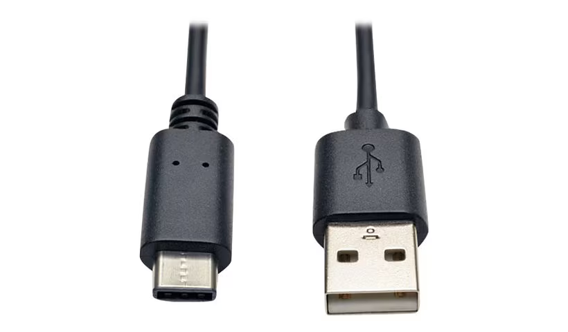 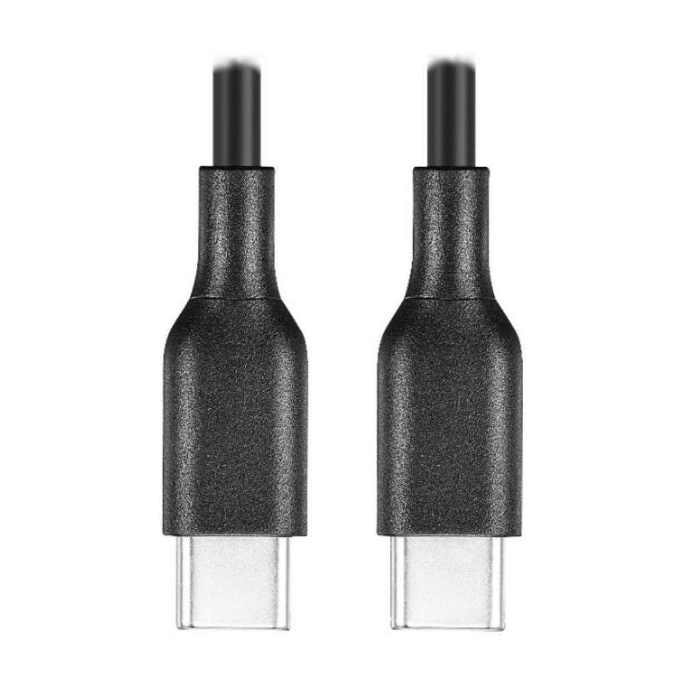

3. Your [Lightnote](https://lightnote.cardonabits.com/products/lightnote-chess-edition-2-0)

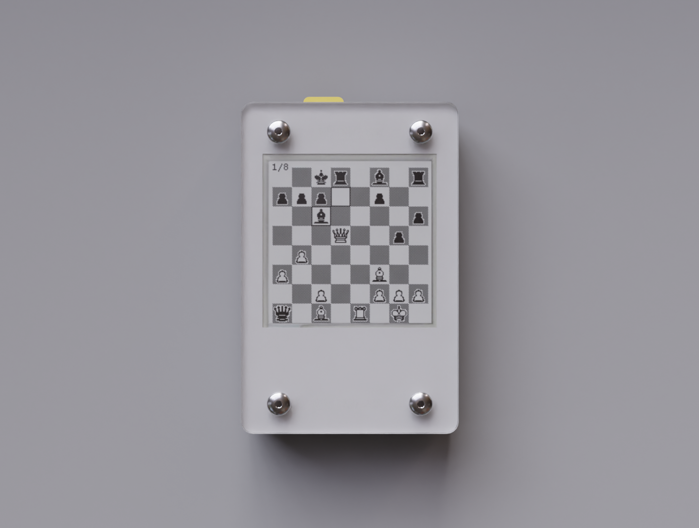

4. A ROM file that you may have obtained from Cardona Bits or from [this repository](roms)

## Steps

1. Attach lightnote to your host and press the lightnote pushbutton until you see the USB icon on the screen.

> [!NOTE]
> On MacOS you may get the following error, which is OK to ignore:
>
> 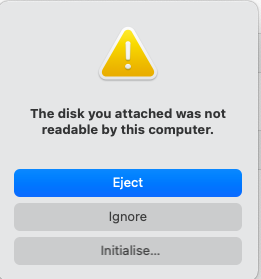

2. Launch balenaEtcher and select 'Flash From File'. 

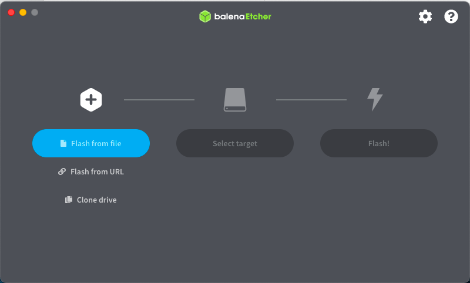

3. Select `All` types of file, then pick the lighnote ROM file you want to install.

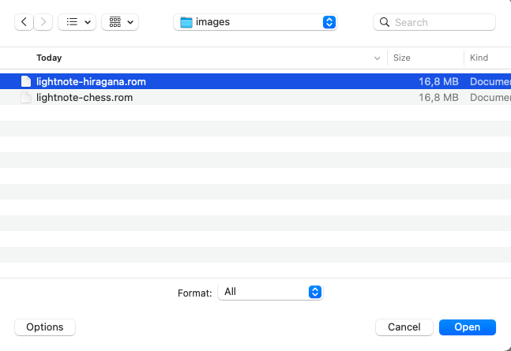

> [!NOTE]
> You will get a warning about a missing partition table.  It is OK to ignore it.
>
> 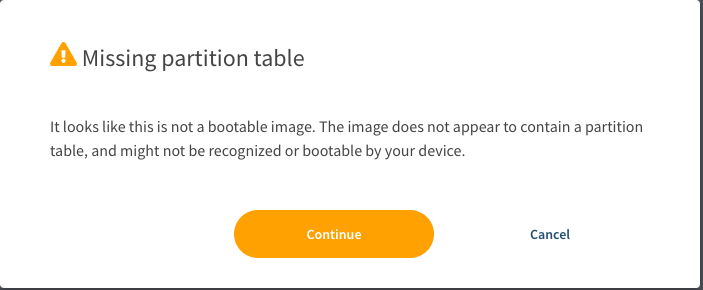

4. Select your installation target to be `Lightnote Media`

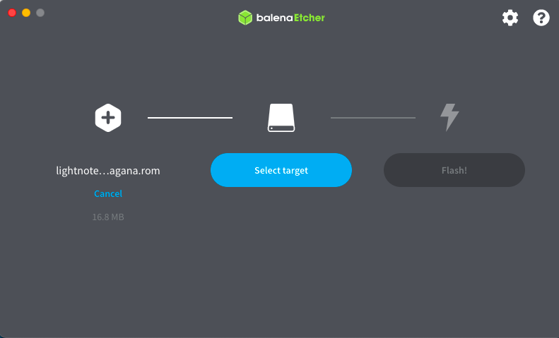
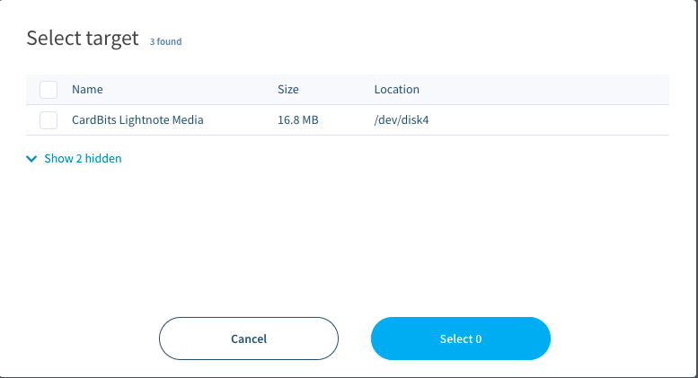

> [!NOTE]
> You may be asked to enter your user password to gain priviledges to write to an external disk.
>
> 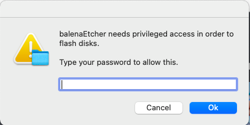

5. Start flashing, and go for a cup of tea:  the flashing process takes about 5 minutes.

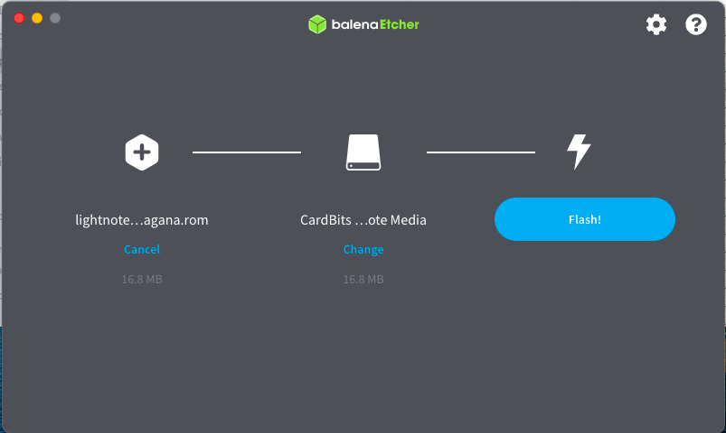
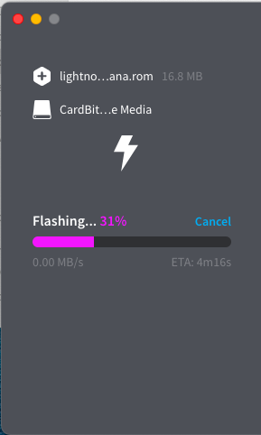
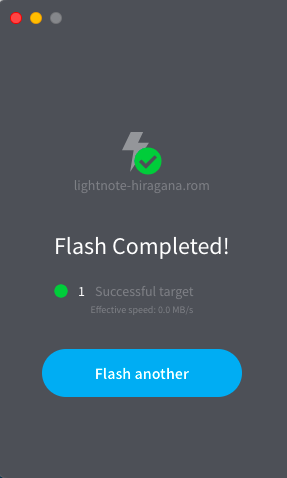

6. Now you can detatch your Lighnote and press the pushbutton to see the new content.

